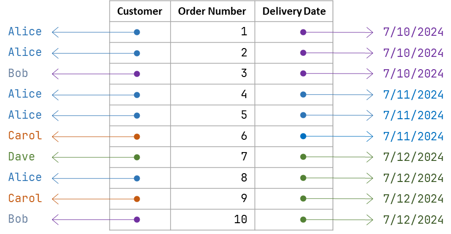
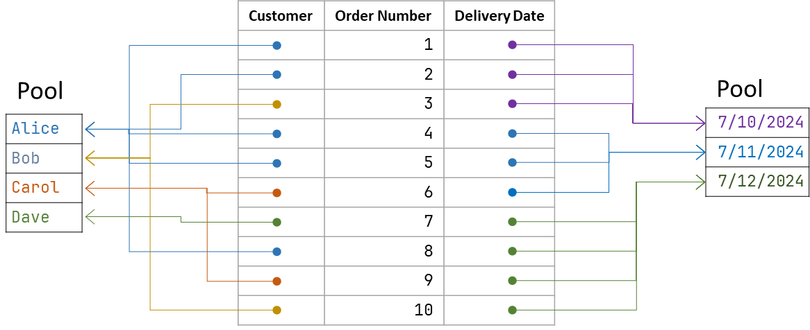

# Pooling

## Introduction

Data Frame instances support (optional) **pooling** of object values. Pooling means that as an object is added to the data frame, it is first looked up in the pool and if an equal object is found, that reference is used. If an equal object is not found, the new object is added to the pool. In other words, with pooling for objects that are equal the memory needs to be allocated for only one instance.

A pool is scoped for a column. 

For columns with a lot of repeating values pooling can result in substantial memory savings and, in certain scenarios, in performance improvements.

### Example 
Let's say there is a data frame storing customer orders. There are three columns: customer name (string), order number (integer), order date (date).

There are 10 rows in the data frame. 

Without pooling there are 10 instances of string objects and 10 instances of date objects.

With pooling, there are 4 instances of strings and 3 instances of dates.

## Managing Pooling

### Enabling and Disabling 

Pooling can be enabled and disabled at the data frame or at the individual column level.

To enabling pooling at the data frame level, call `enablePooling()` on a data frame instance. 

### Data Frame Transformation and Pooling

By default, the data frames created as a result of extracting data from an existing data frame (using methods such as `select`, `reject`, `partition`) will **not** have pooling disabled.

Sometimes one may wish to have pooling enabled for the data frames that are produced by these operations, like in scenarios when derived data frames will have data added to them.

To achieve this, set `poolingStatusInherited` property the on the source data frame to true. If the source data frame has pooling enabled, the derived data frame(s) will have pooling enabled as well.

If the `poolingStatusInherited` property is set to `false` (this is the default) then the derived data frames will not have pooling enabled regardless of the pooling status of the source data frame.

Note that if the source data frame was created with pooling, the derived data frames will benefit from that (the total number of value instances will not increase as no new instances will be created). You only need to set pooling on the derived data frames if you are plannign to add data to it.    